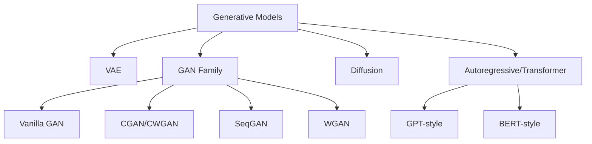

# Deep Dive: So sánh các Generative Models - Hướng dẫn lựa chọn đúng

## 1. Bối cảnh & Động lực (Context & Motivation)

### Câu hỏi gốc
"Tôi đang cần tạo sinh SQL Injection samples, nhưng có quá nhiều lựa chọn: VAE, Diffusion, GAN, Transformers. Tôi nên chọn cái nào?"

### Bối cảnh bài toán SQL Injection
- **Input:** SQL Injection patterns thu thập được
- **Output:** SQL Injection samples mới, biến thể, có thể bypass WAF
- **Ràng buộc:** Dataset không quá lớn (hàng nghìn samples thay vì hàng triệu)
- **Mục tiêu:** Diversity + Validity + (có thể) Bypass capability

---

## 2. Tổng quan các phương pháp (Overview)



---

## 3. So sánh chi tiết (Detailed Comparison)

### 3.1. Đánh giá theo tiêu chí

| Tiêu chí | VAE | Diffusion | GAN | SeqGAN/Gumbel | Transformer |
|----------|-----|----------|-----|---------------|-------------|
| **Data requirement** | Trung bình | Nhiều | Trung bình | Trung bình | Rất nhiều |
| **Training stability** | Cao | Rất cao | Thấp | Trung bình | Cao |
| **Output diversity** | Trung bình | Cao | Thấp | Cao | Rất cao |
| **Mode collapse** | Ít | Không | Nhiều | Trung bình | Không |
| **Sequence modeling** | Yếu | Yếu | Yếu | **Tốt** | **Tốt** |
| **Syntax-aware** | Thấp | Thấp | Thấp | Trung bình | **Cao** |
| **Latent control** | **Cao** | Trung bình | Thấp | Thấp | Thấp |
| **Inference speed** | Nhanh | Chậm | Nhanh | Nhanh | Trung bình |
| **Compute resource** | Thấp | Cao | Thấp | Thấp | Cao |

### 3.2. Đánh giá theo bài toán SQL Injection

| Bài toán cụ thể | Mô hình khuyến nghị | Lý do |
|-----------------|---------------------|-------|
| Data augmentation (tăng cường dữ liệu) | VAE | Nhanh, ổn định, latent space có thể control |
| Tạo biến thể đa dạng | Diffusion | Diversity cao nhất |
| Bypass WAF (adversarial) | **SeqGAN/Gumbel** | RL-based, có reward signal |
| Sinh SQL có cú pháp đúng | Transformer | Hiểu cú pháp SQL |
| Giả lập attack patterns | GAN cơ bản | Không khuyến nghị cho text |

---

## 4. Quyết định theo kịch bản (Decision Tree)

```
START: Bạn có bao nhiêu GPU?
├─ Không có GPU / CPU only
│   └─ Dataset < 5000 samples?
│       ├─ CÓ → VAE (nhanh, ít resource)
│       └─ KHÔNG → SeqGAN với Gumbel-Softmax
│
├─ Có GPU (GTX 1060+)
│   └─ Dataset size?
│       ├─ < 5000 → SeqGAN/Gumbel-Softmax
│       ├─ 5000-50000 → Transformer fine-tuning
│       └─ > 50000 → Diffusion + Transformer
│
└─ Có nhiều GPU (cluster)
    └─ Nếu cần diversity cực cao → Diffusion-LM
```

---

## 5. Triển khai theo từng mô hình (Implementation Guides)

### 5.1. VAE cho SQL Injection - Quick Start

**Ưu điểm:** Nhanh, ổn định, latent space có thể interpolate
**Nhược điểm:** Output đôi khi "mờ" (blurry), không giữ cú pháp tốt

```python
import torch
import torch.nn as nn

class SQLVAE(nn.Module):
    def __init__(self, vocab_size, embed_dim, hidden_dim, latent_dim):
        super().__init__()
        self.encoder = nn.LSTM(embed_dim, hidden_dim, batch_first=True, bidirectional=True)
        self.fc_mu = nn.Linear(hidden_dim * 2, latent_dim)
        self.fc_logvar = nn.Linear(hidden_dim * 2, latent_dim)
        
        self.decoder = nn.LSTM(embed_dim, hidden_dim, batch_first=True)
        self.fc_out = nn.Linear(hidden_dim, vocab_size)
        
        self.latent_dim = latent_dim
        
    def encode(self, x):
        _, (h, _) = self.encoder(x)
        h = torch.cat([h[0], h[1]], dim=-1)
        return self.fc_mu(h), self.fc_logvar(h)
    
    def reparameterize(self, mu, logvar):
        std = torch.exp(0.5 * logvar)
        eps = torch.randn_like(std)
        return mu + eps * std
    
    def decode(self, z, max_len):
        generated = []
        for t in range(max_len):
            if t == 0:
                embed = torch.zeros(1, self.embed_dim).to(z.device)
            else:
                embed = self.embedding(generated[-1])
            out, _ = self.decoder(embed.unsqueeze(0), hidden)
            hidden = out
            probs = F.softmax(self.fc_out(out.squeeze(0)), dim=-1)
            token = torch.multinomial(probs, 1)
            generated.append(token)
        return generated
```

### 5.2. SeqGAN cho SQL Injection - Quick Start

**Ưu điểm:** RL-based, rewards từ discriminator, tốt cho sequence dài
**Nhược điểm:** Cần thiết kế reward function cẩn thận

```python
# Xem chi tiết trong: [[Deep Dive - GAN for Text]]

class SeqGANConfig:
    def __init__(self):
        self.vocab_size = 5000  # SQL vocabulary
        self.embedding_dim = 256
        self.hidden_dim = 512
        self.max_seq_length = 100
        self.lr = 0.001
        self.gumbel_temperature = 0.5
        self.discriminator_steps = 5
        self.generator_steps = 1
```

### 5.3. Transformer cho SQL Injection - Quick Start

**Ưu điểm:** Hiểu cú pháp SQL tốt nhất, output tự nhiên
**Nhược điểm:** Cần nhiều dữ liệu, tốn tài nguyên

```python
from transformers import GPT2LMHeadModel, GPT2Tokenizer

def fine_tune_gpt2_sql(data_path, output_dir):
    model = GPT2LMHeadModel.from_pretrained('gpt2')
    tokenizer = GPT2Tokenizer.from_pretrained('gpt2')
    
    # Thêm SQL special tokens
    special_tokens = {'pad_token': '<PAD>', 'sql keywords': ['SELECT', 'UNION', 'FROM', 'WHERE']}
    tokenizer.add_special_tokens(special_tokens)
    model.resize_token_embeddings(len(tokenizer))
    
    # Fine-tune với SQL injection data
    # Recommend: Ít nhất 10000 samples để fine-tune hiệu quả
    # Training với gradient accumulation nếu GPU limited
```

---

## 6. Checklist chọn mô hình (Selection Checklist)

Trước khi bắt đầu, hãy trả lời:

- [ ] **Dataset size:** < 5000 → VAE/SeqGAN, > 50000 → Transformer/Diffusion
- [ ] **Compute resource:** CPU only → VAE, Single GPU → SeqGAN, Multi-GPU → Transformer/Diffusion
- [ ] **Mục tiêu chính:** Augmentation → VAE, High diversity → Diffusion, Bypass WAF → SeqGAN, Syntax accuracy → Transformer
- [ ] **Timeline:** Cần nhanh → VAE, Có thời gian → Transformer
- [ ] **Success metric:** Diversity ↑ → Diffusion, Validity ↑ → Transformer, Bypass rate ↑ → SeqGAN

---

## 7. Kết nối & Mở rộng (Connections)

- **Xem chi tiết từng mô hình:**
  - [[Deep Dive - VAE]] - Cơ sở lý thuyết VAE cho SQL injection
  - [[Deep Dive - GAN for Text]] - SeqGAN, Gumbel-Softmax implementation
  - [[Deep Dive - Diffusion]] - Diffusion cho text generation
  - [[Deep Dive - Transformers]] - Transformer-based generation

- **Câu hỏi mở:**
  - Kết hợp VAE + SeqGAN có hiệu quả hơn không?
  - Diffusion có thể beat SeqGAN với small dataset không?

---

## 8. Tài liệu tham khảo

- Paper: "Auto-Encoding Variational Bayes" (2013) - VAE gốc
- Paper: "SeqGAN: Sequence Generative Adversarial Nets with Policy Gradient" (2016)
- Paper: "Denoising Diffusion Probabilistic Models" (2020)
- Paper: "Attention Is All You Need" (2017) - Transformer
- Blog: The Illustrated Transformer (Jay Alammar)
- Blog: What are Diffusion Models? (Lilian Weng)